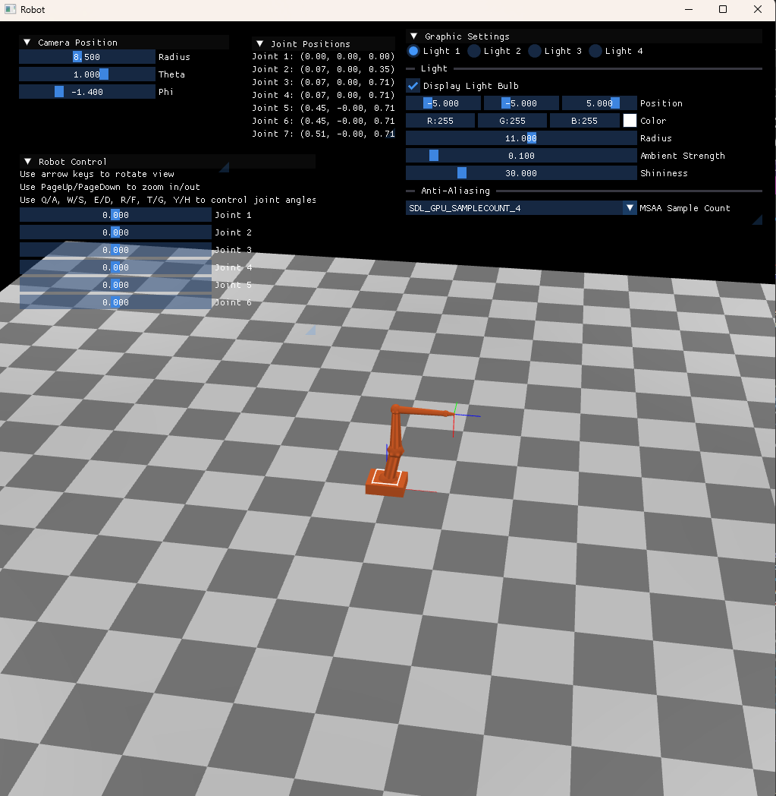

# Robot [](https://github.com/mwthinker/Robot/actions/workflows/ci.yml) [](https://opensource.org/licenses/MIT)
A 3D visualization application of an ABB IRB-140 industrial robot with 6 degrees of freedom. The application uses SDL3 with GPU rendering (via SDL_GPU), HLSL shaders, and implements a custom graphics rendering pipeline with lighting and camera controls.

Based on the master thesis [Haptic Interface for a Contact Force Controlled Robot](https://www.lu.se/lup/publication/8847542), 2009, Lund University.



## Features
- 6-DOF robot arm visualization using Denavit-Hartenberg (DH) parameters
- Real-time forward kinematics computation
- Interactive camera controls with spherical coordinates
- Custom batched geometry rendering system
- Multi-light support with configurable lighting
- MSAA and depth testing
- ImGui integration for UI controls

## Developer environment

### Prerequisites
- CMake 4.2+
- vcpkg (environment variable `VCPKG_ROOT` must be set)
- C++23 compiler (MSVC on Windows, GCC/Clang on Unix)

### Building

Assuming Windows host, otherwise change to "unix"
```bash
git clone https://github.com/mwthinker/Robot.git
cd Robot
cmake --preset=windows -B build
cmake --build build
```

For different build configurations:
```bash
# Debug build
cmake --preset=windows -B build_debug -DCMAKE_BUILD_TYPE=Debug
cmake --build build_debug

# Release build
cmake --preset=windows -B build_release -DCMAKE_BUILD_TYPE=Release
cmake --build build_release
```

### Running Tests
Tests use Google Test framework:
```bash
# Run all tests
ctest --test-dir build/Robot_Test

# Run with verbose output on failure
ctest --rerun-failed --output-on-failure --test-dir build/Robot_Test
```

## Architecture

### Core Components
- **RobotWindow**: Main application window managing the render loop and ImGui integration
- **RobotGraphics**: Robot kinematics implementation using DH parameters
- **Graphic**: Core rendering abstraction layer with batched geometry system
- **Shader**: HLSL vertex and pixel shaders with lighting calculations
- **Camera**: Spherical coordinate camera system

### Rendering Pipeline
The application uses a modern GPU-accelerated rendering pipeline with:
- Batched geometry submission for efficiency
- Matrix stack for transformations
- Multi-pass rendering (GPU copy + MSAA render + blit to swapchain)
- Embedded compiled shaders (DXIL and SPIR-V)

```mermaid
flowchart TD
    Start([Application Start]) --> Init[Initialize SDL3 & GPU Device]
    Init --> PreLoop[preLoop - Setup Phase]

    subgraph Setup["Setup Phase (Once)"]
        PreLoop --> LoadShaders[Load HLSL Shaders<br/>Vertex & Pixel]
        LoadShaders --> CreatePipeline[Create Graphics Pipelines<br/>Triangles]
        CreatePipeline --> CreateTextures[Create Textures<br/>Depth, Color, Resolve]
        CreateTextures --> CreateSamplers[Create Samplers]
    end

    CreateSamplers --> LoopStart{Main Loop}

    subgraph Render["Rendering Phase"]
        LoopStart --> PollEvents[Poll Events<br/>processEvent]
        PollEvents --> ImGuiNewFrame[ImGui New Frame]
        ImGuiNewFrame --> RenderImGui[renderImGui<br/>Build UI Controls]
        RenderImGui --> ImGuiRender[ImGui::Render]
        ImGuiRender --> AcquireGPU[Acquire GPU Command Buffer<br/>& Swapchain Texture]

        subgraph AppRender["renderFrame - 3D Graphics"]
            AcquireGPU --> UpdateCamera[Update Camera<br/>Spherical Coordinates]
            UpdateCamera --> ClearBatch[Clear Geometry Batches]
            ClearBatch --> BuildGeometry[Build Geometry]

            subgraph Geometry["Geometry Building"]
                BuildGeometry --> AddRobot[Add Robot<br/>DH Kinematics]
                AddRobot --> AddFloor[Add Floor Grid]
                AddFloor --> AddLights[Add Light Bulbs]
                AddLights --> AddWorkspace[Add Workspace Bounds]
            end

            AddWorkspace --> GPUCopy[GPU Copy Pass<br/>Transfer Vertex/Index Data]
            GPUCopy --> UploadUniforms[Upload Uniforms<br/>Projection, View, Lighting]
            UploadUniforms --> BeginRender[Begin Render Pass<br/>Depth + Color Targets]
            BeginRender --> BindDraw[Bind Pipelines & Draw<br/>Batched Geometry]
            BindDraw --> EndRender[End Render Pass]
            EndRender --> Resolve{MSAA?}
            Resolve -->|Yes| ResolvePass[Resolve MSAA]
            Resolve -->|No| Blit
            ResolvePass --> Blit[Blit to Swapchain]
        end

        Blit --> ImGuiDraw[ImGui Draw Pass<br/>UI on Top]
        ImGuiDraw --> Submit[Submit GPU Commands]
    end

    Submit --> Sleep[Optional Sleep<br/>Frame Rate Limit]
    Sleep --> LoopStart

    style Setup stroke:#4682b4,stroke-width:3px
    style Render stroke:#daa520,stroke-width:3px
    style AppRender stroke:#228b22,stroke-width:3px
    style Geometry stroke:#696969,stroke-width:2px
```



## Dependencies
Custom [vcpkg registry](https://github.com/mwthinker/mw-vcpkg-registry.git):
- **cppsdl3**: SDL3 and ImGui C++ wrapper library

## Open source
The code is licensed under the MIT License (see LICENSE.txt).
